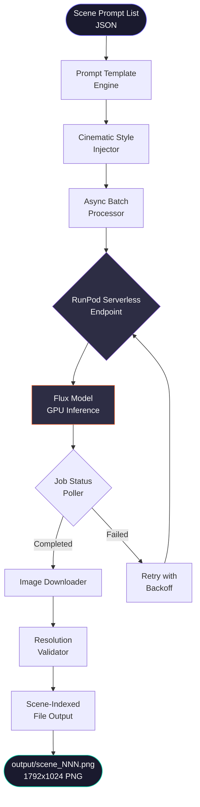

<div align="center">


</div>

---

## Overview

`flux-image-pipeline` is a high-throughput, cost-optimised image generation system built around Flux (Black Forest Labs) running as a serverless endpoint on RunPod GPU infrastructure — engineered specifically for the visual demands of automated documentary-style YouTube content at scale. Where consumer image generation tools optimise for single-image quality, this pipeline optimises for batch throughput, per-image cost, and downstream composability: every image is generated at 1792×1024 with deliberate resolution headroom for Ken Burns pan-and-zoom at 1080p, output with cinematic prompt templates tuned for historical and documentary aesthetics, and indexed with scene numbers for direct ingestion by FFmpeg assembly pipelines. Async concurrency control keeps RunPod utilisation high without exceeding rate limits, while automatic retry with exponential backoff ensures batch jobs complete reliably without operator monitoring.

---

## Architecture



---

## Features

- **RunPod serverless GPU** — zero idle cost; GPU seconds billed only during active inference
- **Flux model quality** — state-of-the-art photorealism and prompt adherence for documentary aesthetics
- **Cinematic prompt templates** — built-in style presets for historical, documentary, aerial, and macro cinematography
- **Ken Burns optimised output** — 1792×1024 resolution provides headroom for pan-and-zoom without quality loss at 1080p
- **Async concurrent requests** — configurable concurrency sends multiple generation jobs in parallel for maximum throughput
- **Automatic retry with backoff** — failed jobs retry up to 3 times with exponential backoff; no batch job left incomplete
- **Scene-indexed output** — images saved as `scene_001.png`, `scene_002.png` etc. for direct FFmpeg assembly ingestion
- **Cost tracking** — per-run cost estimate logged based on RunPod GPU-second pricing
- **JSON batch input** — structured scene list with per-scene prompt overrides and style modifiers
- **Resolution validation** — output images verified against target dimensions before downstream delivery

---

## Requirements

- Python 3.11+
- RunPod account with Flux deployed as a Serverless endpoint
- RunPod API key
- `httpx`, `Pillow`, `asyncio` (installed via requirements.txt)

---

## Installation

```bash
git clone https://github.com/InFrontWebs/flux-image-pipeline.git
cd flux-image-pipeline

python -m venv venv
source venv/bin/activate          # Windows: venv\Scripts\activate

pip install -r requirements.txt
```

Configure your RunPod endpoint:

```bash
cp config/pipeline_config.yaml.example config/pipeline_config.yaml
# Edit pipeline_config.yaml: set your endpoint_id and preferred resolution
```

Set your API key:

```bash
export RUNPOD_API_KEY=your_runpod_api_key
```

---

## Quick Start

**Generate images from a JSON scene list:**

```bash
python pipeline/batch.py --scenes scenes.json --output output/
```

`scenes.json` format:

```json
[
  {
    "index": 1,
    "prompt": "Ancient Roman forum at golden hour, senators debating, cinematic wide angle",
    "style": "historical"
  },
  {
    "index": 2,
    "prompt": "Silk Road caravan crossing Gobi Desert at dusk, aerial view, film grain",
    "style": "documentary"
  },
  {
    "index": 3,
    "prompt": "Medieval illuminated manuscript extreme macro detail, candlelight, dramatic shadow",
    "style": "macro"
  }
]
```

**Generate a single image:**

```bash
python pipeline/generator.py \
  --prompt "Byzantine cathedral interior, golden mosaics, shafts of light, 8K photorealistic" \
  --output output/scene_001.png
```

**Run with custom concurrency:**

```bash
python pipeline/batch.py --scenes scenes.json --output output/ --concurrency 5
```

---

## Roadmap

- [x] RunPod serverless endpoint integration
- [x] Async batch processor with concurrency control
- [x] Cinematic prompt template engine
- [x] Scene-indexed file output
- [x] Automatic retry with exponential backoff
- [x] Resolution validation
- [ ] Multiple style preset packs (sci-fi, nature, urban)
- [ ] Automatic Ken Burns motion vector export for FFmpeg
- [ ] Cost dashboard with per-batch spend tracking
- [ ] ComfyUI local fallback when RunPod unavailable
- [ ] Image upscaling pass via Real-ESRGAN

---

## License

MIT — see [LICENSE](LICENSE)

Built by [InFrontWebs](https://infrontwebs.com) · Bangladesh


